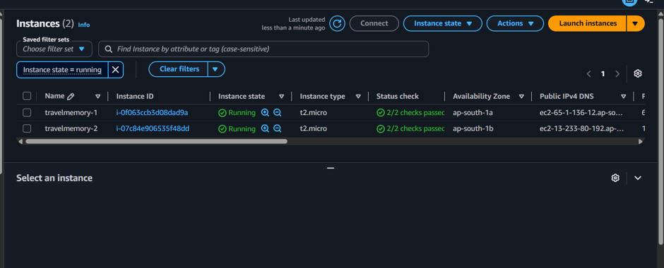
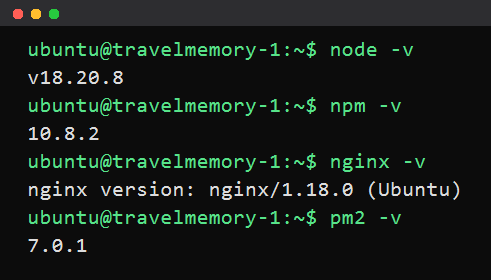
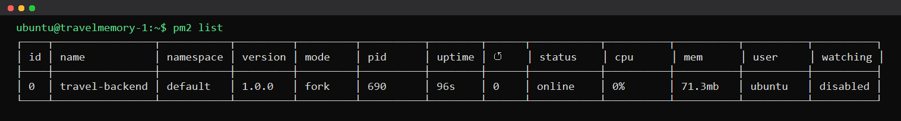
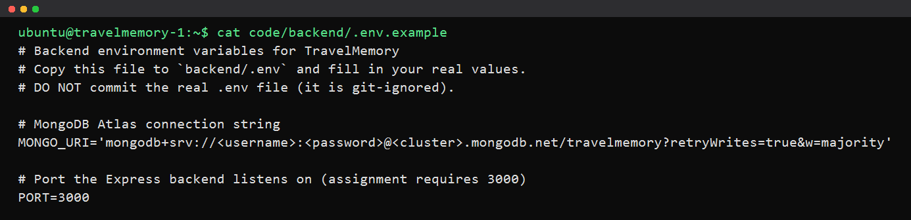
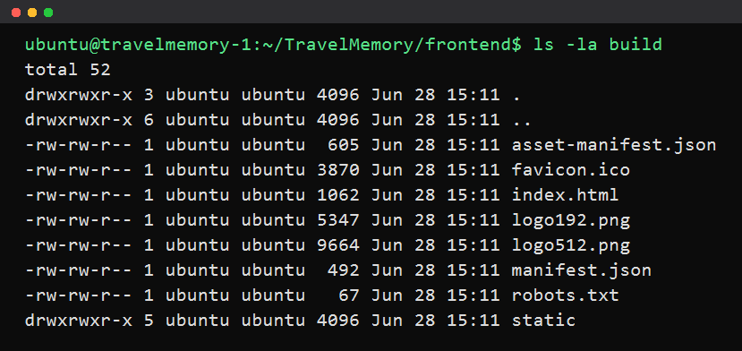
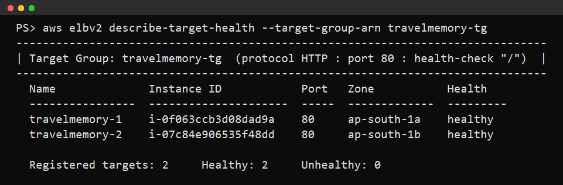
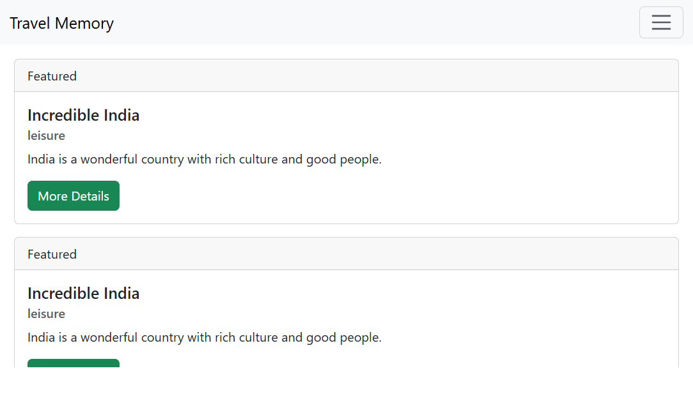
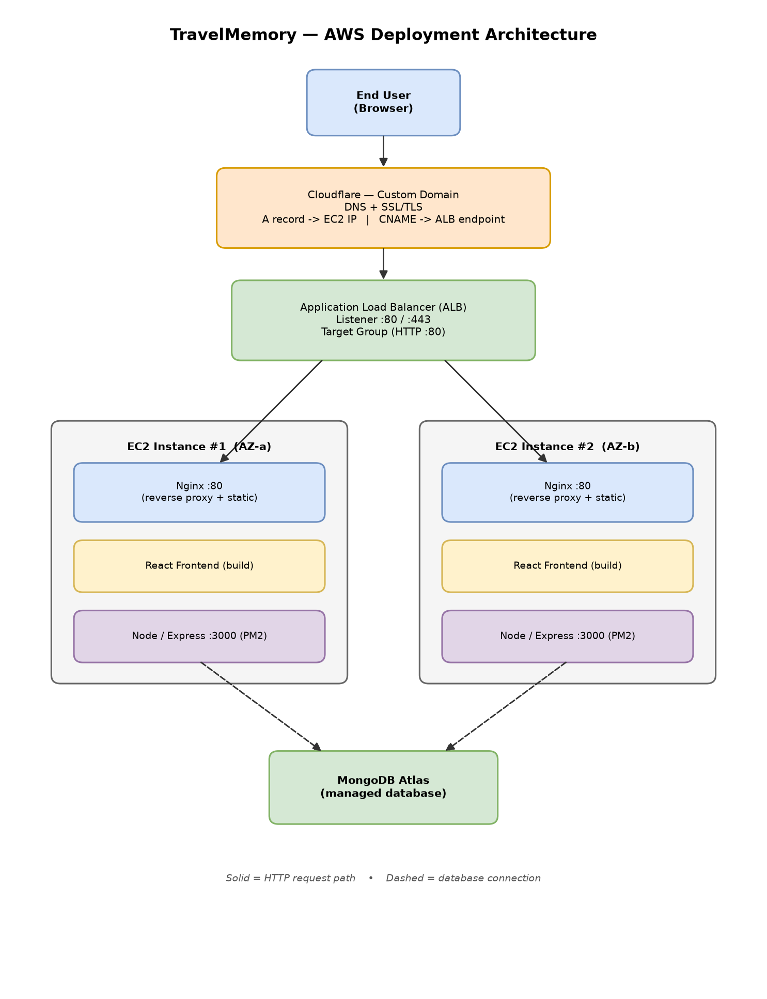

# Deployment walkthrough

This is the narrative version with screenshots. The full commands are in
[README.md](README.md); here I'm just showing each stage worked. Screenshots live
in the `screenshots/` folder.

A couple of the placeholders below (Cloudflare DNS, the live HTTPS domain) are
from steps I documented but didn't run on the graded deployment, since I didn't
have a domain to point at Cloudflare. The AWS side is all real and captured.

## 1. EC2 instance running

The instance up with its public IP and security group.

## 2. Dependencies installed

`node -v`, `nginx -v`, `pm2 -v` after the install.

## 3. Backend on port 3000

`pm2 status` showing `travel-backend` online, plus a `curl localhost:3000/trip`.

## 4. Backend .env

`backend/.env` with the Mongo URI (password blurred) and `PORT=3000`.

## 5. Frontend built

`npm run build` finishing, and `url.js` / `.env` pointing at `/api`.

## 6. Nginx serving the app

The app loading at the instance IP. This is the real screenshot from my run - it
shows the trip I added rendering through Nginx.

## 7. Load balancer

Both targets healthy in the target group.

The same app served through the load balancer DNS name. Also a real screenshot.

## 8. Cloudflare DNS

CNAME to the ALB and A record to an instance IP (documented step).

## 9. Live on the domain

The app over HTTPS on the custom domain (documented step).

## 10. Architecture diagram

Exported from `architecture/travelmemory-architecture.drawio`.

## Notes

A few decisions worth calling out:

* Backend is on port 3000 because the assignment asks for it, even though the
  upstream repo defaults to 3001.
* The frontend config file is `url.js`, not `urls.js` like the brief says.
* I went with the Nginx setup that serves the static build and proxies `/api` on
  the same host. Keeping it same-origin meant no CORS configuration to fight with.
